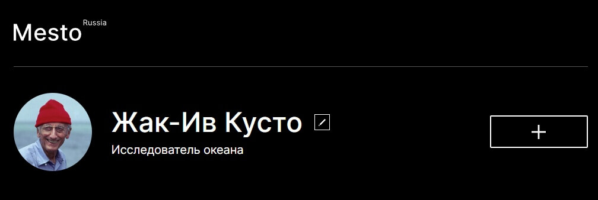
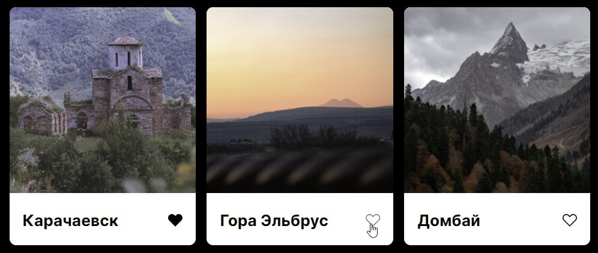
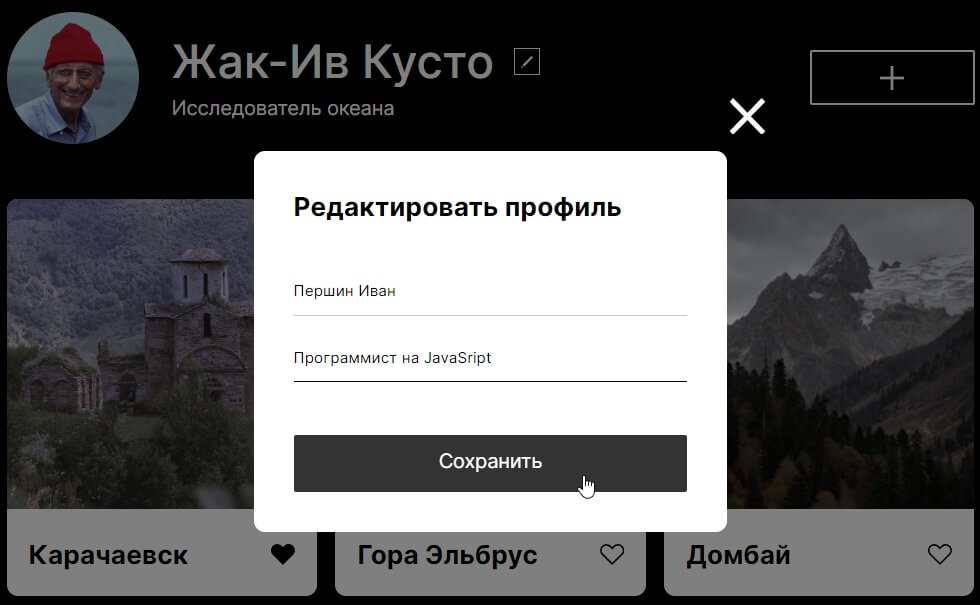
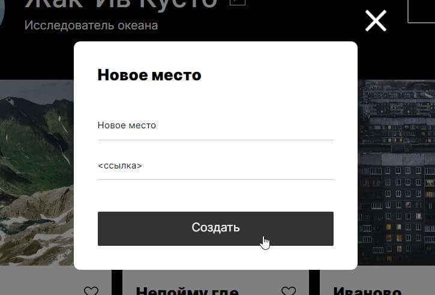
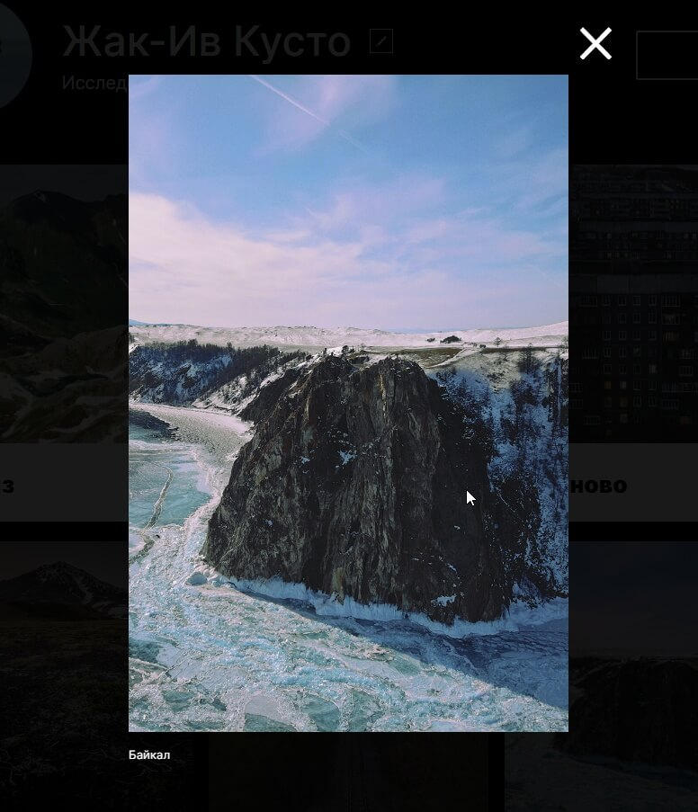

# Mesto

**[Перейти на сайт](https://shekko777.github.io/mesto/)**


---

## Скачать

```
git clone https://github.com/Shekko777/mesto.git
```

---

## О проекте

**Информационный сайт с возможностью делиться картинками**

1. **Уникальные профили**



2. **Возможность оценивать публикации**



3. **Элегантное редактирование профиля**



4. **Полностью адаптивная вёрстка**


5. **Возможность добавлять новые картинки**



6. **Открытие полномасштабного изображения**



---

## Используемые технологии

- **Массив обьектов для начального заполнения**

```
const element = () => {};
```

- **Клонирование template для создания новых карточек**

```
const template = document.querySelector('template').content.cloneNode(true);
```

- **Стрелочные функции для упрощения записи**

```
const arr = [{Object}, {Object}];
```

- **Перебор массива элементов**

```
element.forEach((el) => {});
```

- **Создание временных переменных при вызове функций**

```
function name() {
    const element;
    return;
}
```
